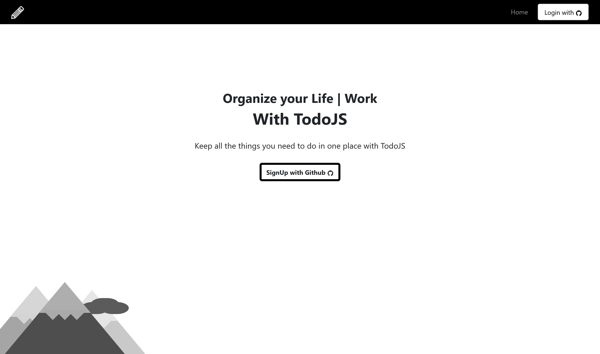
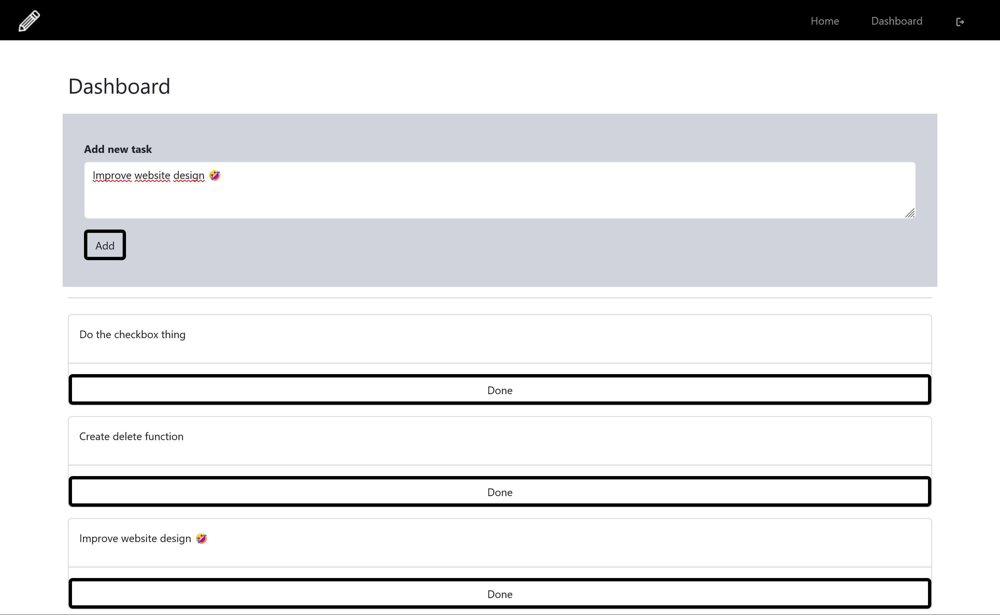

# ToDo App (Vite+React+Supabase)

> A ToDo App website using ViteReactJS

Deployed on **Vercel**, it connects to a **Supabase** database to retrieve users data. 

It uses Github OAuth Api to signUp into the app

After signing in, you can go to the dashboard page to
- Add your To Do Tasks.
- Checkbox the done tasks
- Delete the done tasks

### Screenshots from the website

# References:
- https://blog.openreplay.com/authentication-in-react-with-supabase/

- https://github.com/supabase/examples-archive/tree/main/supabase-js-v1/todo-list/react-todo-list

- https://yesicon.app/

- https://supabase.com/docs/reference/javascript/

- https://getbootstrap.com/docs/5.3/getting-started/introduction/

- https://supabase.com/docs/guides/auth/social-login/auth-github